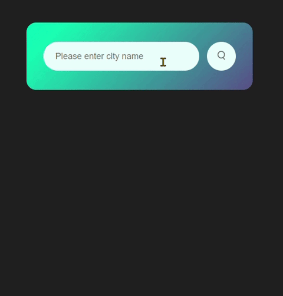

# Weather App

This weather application allows users to view weather information for a specific city. Weather information is obtained using the OpenWeatherMap API.
### Technologies Used 🚀
- HTML
- CSS
- JavaScript

## Installation
- Clone the project to your computer:

   ```bash
   git clone https://github.com/NisaGokdemir/weather-app.git
   cd weather-app
## Usage
1. Open the index.html file in your browser.
2. Enter the city name in the text box labeled "Please enter city name."
3. Click the "Search" button or press the "Enter" key after typing the city name to display weather information.

## API Key 🔗
To use this Weather App, you'll need to obtain an API key from [OpenWeatherMap](https://openweathermap.org/). Once you have the API key, follow the steps below:

1. Go to [OpenWeatherMap](https://openweathermap.org/) and sign up for a free account.
2. After signing in, navigate to your account settings to find or generate your API key.
3. Copy the API key.

## Features ✨
- Displays an "Invalid city name" warning when an incorrect city name is entered.
- Displays information such as city name, temperature, humidity, and wind speed when weather information is successfully retrieved.
- Shows different weather icons based on the weather conditions.

    

## Live Demo 🌐
Live Demo : [Weather App](https://weather-app-five-omega-39.vercel.app/)

## Contribution 🎯
If you would like to contribute to this project, please refer to the CONTRIBUTING.md file.

Feel free to use and customize the project! If you have any questions or feedback, you can reach me at nisagokdemir@gmail.com Enjoy!

